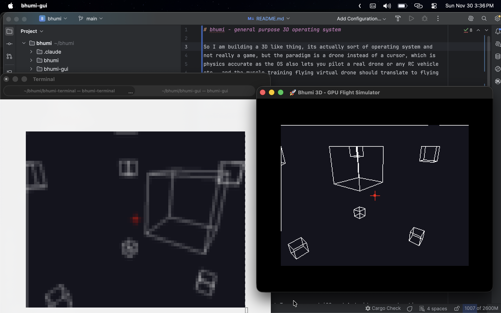

Pre Archive Note: Dev moved to https://github.com/fastn-stack/spatial and https://github.com/amitu/spatial

# 🚧 (unreleased alpha stage software) bhumi — a spatial operating system 🚧

So I am building a 3D like thing, its actually sort of operating system and 
not really a game, but the paradigm is a drone instead of a cursor, which is 
physics accurate as the OS also lets you pilot a real drone or any RC vehicle 
etc., and the muscle training flying virtual drone should translate to flying 
real ones. 

Instead of desktop, we have rooms or open spaces. Instead of hyperlinks, we 
have portals. 

I want to support multiple independent input and output devices. 

I should be able to use traditional keyboard so i can fly with wasd-ikjl etc., 
but type text using regular qwerty keyboard. I also want to support gamepad as 
that is a lot more natural for flying drones, my core interaction primitive. 

For output, I want 2D GPU accelerated rendering, but I also want VR / 3D 
rendering so I can use Oculus / Apple AR headset etc. But I also want to go low 
tech, a 320x240 LED display, and render the whole thing on microcontroller with 
a few MBs of RAM. 

I am thinking of using Rust as much as I can. I also want to implement a custom 
VM (risc-v inspired so tomorrow it can become a chip and run natively), for 
user plugins and hooks, with a custom expression language. No object-oriented, 
no big files, just one file per function, each function body is as simple, lisp 
like, minimal required syntax but Rust inspired flavor and not lisp parentheses 
madness.

The plugin language will also be able to build 3D (CNC machine, 3D printable) 
models, for letting users construct 3D objects they can place around.

For now, we will support Tauri powered iOS and Android apps, and webapps.

## Operational Model

The system is single user mode, meaning all data is stored locally, and for a
single user, no user data mixing. All data will always be local, with sync 
plugins taking care of backup and sync.

User sharing etc. will be implemented in a privacy / ownership friendly way, so
say if I give you portal access to a "room", by writing appropriate plugin, we
will have iroh like peer to peer connectivity, so you can "visit" my "room", if
I am online, you have my room id52, and my plugin system allows you to access 
it. In such mode rendering will happen on my machine, and we will stream the
content to you. You will be able to clone objects or the entire room if my 
plugin setup allows you to.

The plugin system will decide what objects in my room are visible to you, which
ones you can "interact" with, the interaction plugin hooks will be called based
on your actions and so on.

## Apology: AI Slop

Currently, this repo is fully AI generated, I am playing with random ideas, and
will be rebuilding everything from scratch when I get a sense of what I am
building.

## License: The Universal Permissive License 

UPL, Version 1.0, Copyright: 2025 Amit Upadhyay
